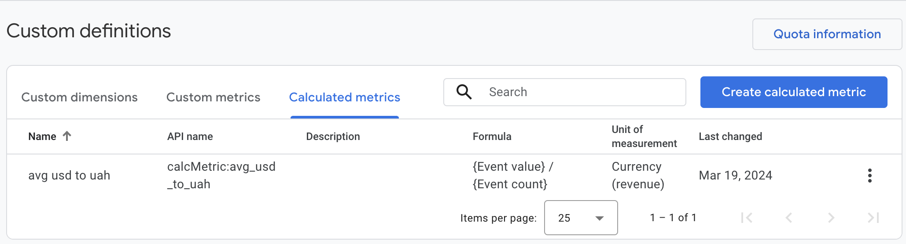
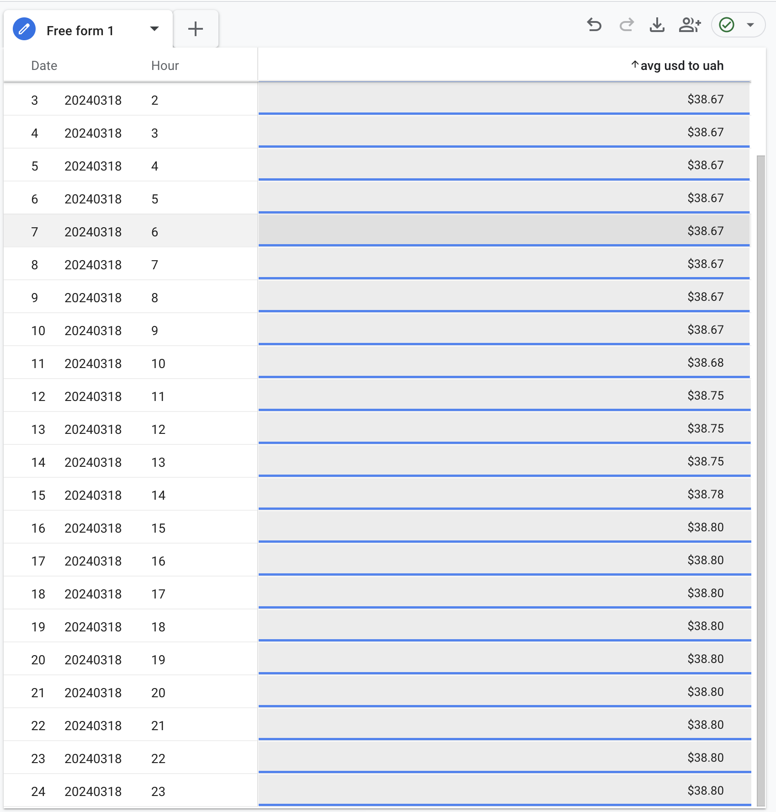
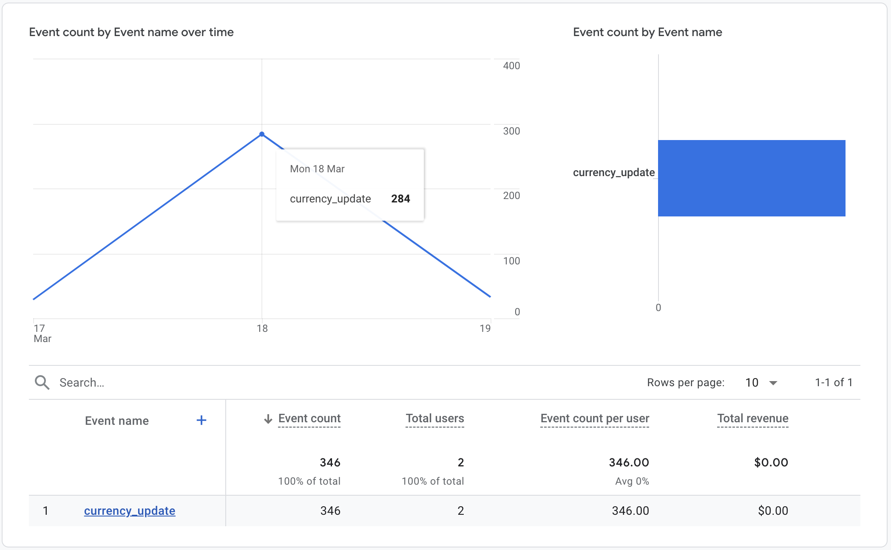
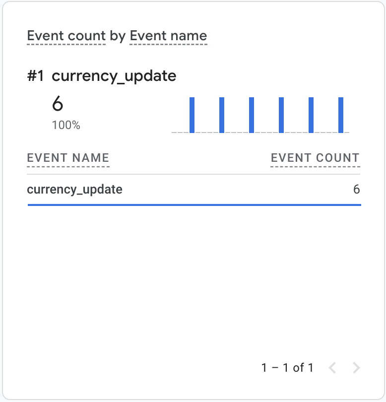

# HSA L4 Homework: Monitoring systems for user metrics

## Introduction

This homework setups monitoring system for user metrics. It has the following components:
- Python script [worker.py](src/worker.py) which gets USD to UAH rates from MonoBank API
- AWS EC2 instance to run the worker
- GA4 Property to collect user metrics

## Setup

1. Navigate to the directory with `worker.py` file
2. Initialize virtual environment using `python -m venv env`
3. Activate virtual environment using `source env/bin/activate`
4. Install dependencies using `python3 -m pip install requests`
5. Run the worker using `python3 worker.py`
6. Setup cron job to run the worker every 5 minutes using `crontab -e` and adding the following line:
   ```
   */5 * * * * python3 /usr/local/bin/worker.py >> /usr/local/bin/output.log 2>&1
   ```
Where `/usr/local/bin/worker.py` is the path to the worker script and `/usr/local/bin/output.log` is the path to the log file.

## Results

Event is sent to GA4 property every time the worker is run.

### Setup custom definitions

Setup calculated metrics to get the average rate per event.



### Explore - Free From chart



### Event count stats



### Realtime


