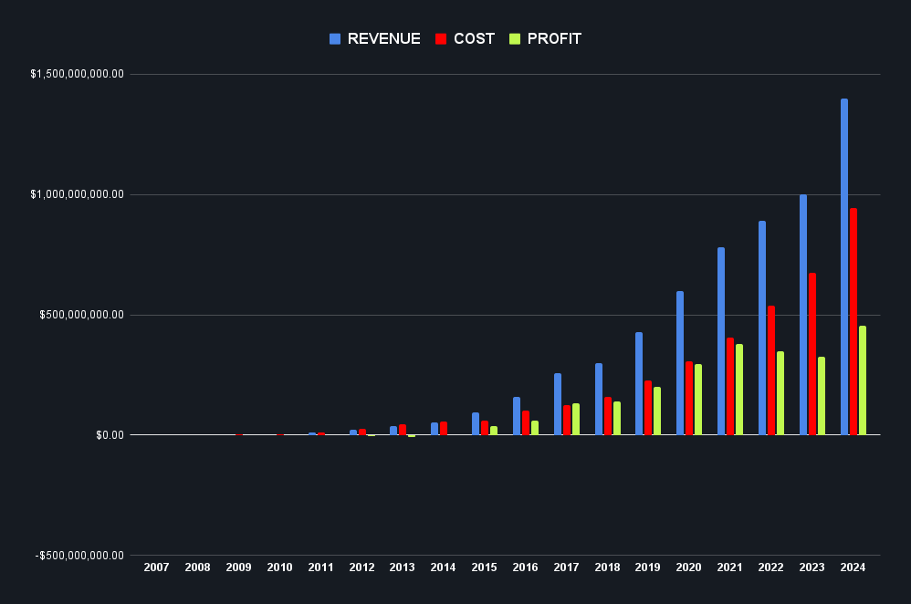

# Homework: GitHub Financial Model

## Task

1. Adopt [the financial model](https://docs.google.com/spreadsheets/d/1SnQEnx-0EW-E4lx07yM0kbZ_5rco3dXmMf1kYoOEhMY/edit?usp=sharing) to GitHub.
2. Find out if the acquisition of GitHub by Microsoft has already paid off.

## Solution

Google Sheets: [GitHub Financial Model](https://docs.google.com/spreadsheets/d/18hRotgpXVpI85f9vgPm4XcE-6EjhPO5NxC-C3PvHctY/edit?usp=sharing)

### Resources and Assumptions

1. [Timeline of GitHub](https://en.wikipedia.org/wiki/Timeline_of_GitHub)
2. [TechCrunch: Microsoft has acquired GitHub for $7.5B in Microsoft stock](https://techcrunch.com/2018/06/04/microsoft-has-acquired-github-for-7-5b-in-microsoft-stock/)
3. [TechCrunch: Microsoft says GitHub now has a $1B ARR, 90M active users](https://techcrunch.com/2022/10/25/microsoft-says-github-now-has-a-1b-arr-90m-active-users/)
4. [GIST: How to monetize your startup](https://getgist.com/how-to-monetize-your-startup/)
5. [Investopedia: CapEx vs. OpEx](https://www.investopedia.com/ask/answers/112814/whats-difference-between-capital-expenditures-capex-and-operational-expenditures-opex.asp)

> Microsoft acquired GitHub for $7.5 billion in Microsoft stock in 2018.

> GitHub had reported an annual recurring revenue of $200 to $300 million at the time of the acquisition.

#### Marketing

It's hard to find the marketing expenses of GitHub. However, we can assume **marketing-to-revenue (M/R) ratio**:
- Early Stage (High Growth): 100% (2007 - 2009)
- Growth Stage: 50% (2010 - 2014)
- Mature Stage: 30% (2016 - 2024)

### Has the acquisition of GitHub by Microsoft already paid off?

#### Accounting GitHub's profit

Microsoft acquired GitHub for $7.5 billion in Microsoft stock in 2018.
Based on my [GitHub Financial Model](https://docs.google.com/spreadsheets/d/18hRotgpXVpI85f9vgPm4XcE-6EjhPO5NxC-C3PvHctY/edit?usp=sharing)
by the end of 2024 (6 years after the acquisition), GitHub will have its profit of **$2.2 billion since 2018**. It's still **less than the acquisition price**, but it's a good sign that GitHub is on the right track.

#### Accounting GitHub's growth

Looks like GitHub is investing in grows. The company has more and more personnel year by year.

#### Accounting Microsoft's stock price growth

Microsoft's stock price growth since 2018 which is **360%** $7.5 billion in 2018 is now **$27 billion**.

#### Conclusion

**It has not paid off yet**. Especially, if we consider Microsoft's stock price growth. However, GitHub is on the right track.

### Chart

