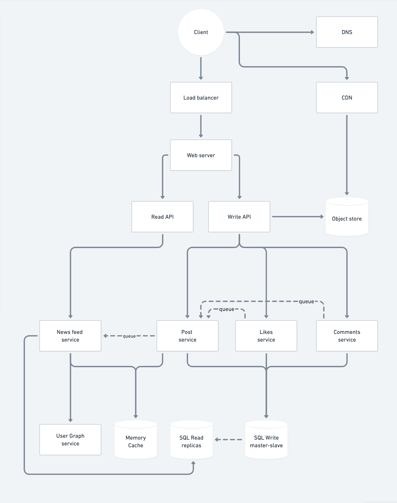

# HSA L07 Homework: High Load Applications Architecture

## Task

- Choose proper architecture pattern for Instagram services
- Find what will be bottleneck in each case
- Find what might be a SPOF in each case 
- We analyse just news feed that contains video and photos. We are interested only in likes and comments functionality

## Step 1: Outline use cases and constraints
> Gather requirements and scope the problem. Ask questions to clarify use cases and constraints. Discuss assumptions.

### Use cases

#### I'll scope the problem to handle only the following use cases

- User requests news feed
- User likes/dislikes a post
- User comments a post
- User uploads a post

### Constraints and assumptions

#### State assumptions

- Over 500 million users per day
- Traffic is not evenly distributed
  - Some posts will be more popular than others
- Follows are not evenly distributed
  - 75% of users have less than 10,000 followers
  - A significant portion falls between 1,000 and 10,000 followers
  - The average might be around 1,000 followers
- Flowing count
  - Large portion follows a small number of accounts (100-200)
- News feed
  - News feed should be close to real-time and fast
  - It's more read-heavy than write-heavy

#### Calculate usage

| Request   | Request type | Avg user per day | Total per second |
|-----------|--------------|------------------|------------------|
| News feed | Read         | 5                | 29k              |
| Content   | Read         | 50               | 289k             |
| Likes     | Write        | 4                | 28k              |
| Comments  | Write        | 0.8              | 4.5k             |
| Uploads   | Write        | 0.6              | 3.5k             |
|           |              |                  |                  |
| Total     | Read         | 55               | 318k             |
| Total     | Write        | 5.4              | 36k              |

## Step 2: Create a high level design
> Outline a high level design with all important components.

- Client
- Web server
  - Write API
  - Read API
  - User Graph service
  - News feed service
  - Post service
  - Like service
  - Comment service
- Database
  - Post data
  - Like data
  - Comment data
- Object storage
    - CDN
- Memory Cache
- Message queue

## Step 3: Design core components
> Dive into details for each core component

### Use case: User uploads a post

- `Client` sends a request to `Web server` running as a reverse proxy
- `Web server` forwards the request to `Write API`
- `Write API`
  - Saves the post media to `Object storage`
  - Contacts `Post service` to save the post metadata to `Database`
- `Post service`
  - Saves the post metadata to `Database` and to `Memory Cache`
  - Sends a message to `Message queue` to update the news feed
- `News feed service` gets the message from `Message queue`
  - Fetches the followers from `User Graph service` (`Memory Cache`)
  - Updates the news feed in `Memory Cache` for each follower

### Use case: User requests news feed

#### Get news feed
- `Client` sends a request to `Web server` running as a reverse proxy
- `Web server` forwards the request to `Read API`
- `Read API`
  - Contacts `News feed service` to fetch the news feed for the user
  - `News feed service` returns the news feed from `Memory Cache`

#### Getting media content
- `Client` sends a request to `CDN` to fetch the media content (one or more requests per post)
- `CDN` returns the media content

### Use case: User likes/dislikes a post

- `Client` sends a request to `Web server` running as a reverse proxy
- `Web server` forwards the request to `Write API`
- `Write API`
  - Contacts `Like service`
- `Like service`
  - Saves the like/dislike to `Database
  - Sends a message to `Message queue` to asynchronously update the like count and likes list in read models

### Use case: User comments a post

- `Client` sends a request to `Web server` running as a reverse proxy
- `Web server` forwards the request to `Write API`
- `Write API`
  - Contacts `Comment service`
- `Comment service`
  - Saves the comment to `Database
  - Sends a message to `Message queue` to asynchronously update the comment read models

## Step 4: Scale the design

> Identify and address bottlenecks, given the constraints. 
> 
> SPOF - Single Point of Failure

### Bottlenecks

- `Web server` - our entry point where all requests come in (can be a `SPOF`)
  - Support horizontal scaling by adding more instances
  - Use a `Load balancer` to distribute the traffic
- Use multiple `Load balancers` in order to
  - Avoid a `SPOF`
  - Distribute the traffic (for instance geographically)
  - Provide redundancy, ensuring high availability in case one fails
  - Scale horizontally
- `Write API` - may be a bottleneck for write operations
  - Support horizontal scaling by adding more instances behind a `Load balancer`
  - Use a `Message queue` to handle asynchronous operations
- `Read API` - may be a bottleneck for read operations
  - Support horizontal scaling by adding more instances behind a `Load balancer`
  - Use `Memory Cache` to cache data where possible
  - Use `CDN` to cache media content
- `Database` - may be a bottleneck
  - Use sharding to distribute the load
  - Use replication to distribute the load for read-heavy operations
  - Use `Memory Cache` instead of `Database` access where possible as it's much faster
- `Object storage` - may be a bottleneck
  - Use sharding to distribute the load
  - Use `CDN` to cache media content
- `Memory Cache` - may be a bottleneck
  - Use sharding to distribute the load
  - Use replication to distribute the load for read-heavy operations
- Each service may be a bottleneck
  - Support horizontal scaling by adding more instances behind a `Load balancer`
  - Use `Message queue` to handle asynchronous operations
  - Use `Memory Cache` to cache data where possible

### Schema

