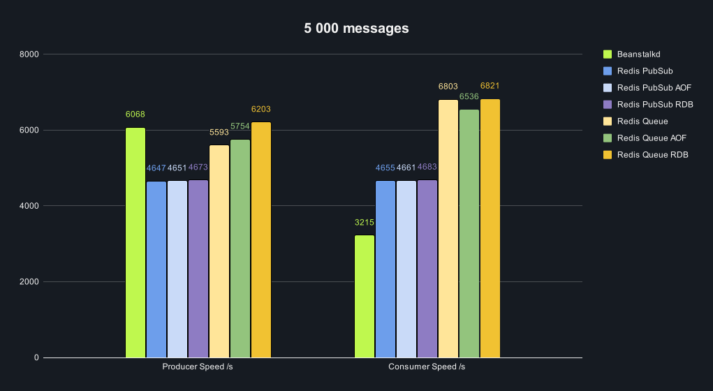
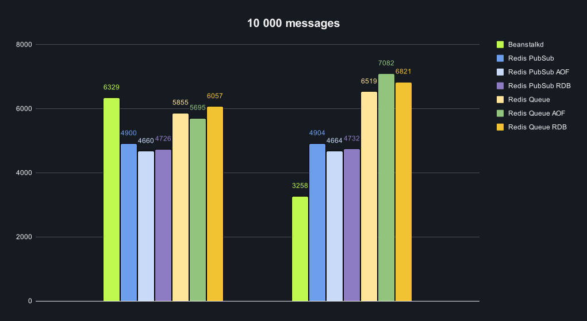

# HSA L11 Homework: Queues

## Task

- Set up 3 containers - beanstalkd and redis (rdb and aof)
- Write 2 simple scripts: 1st should put message into queue, 2nd should read from queue
- Configure storing to disk
- Compare queues performance

## Setup

- Up containers using `docker-compose up -d`
  - `Beanstalkd` is available on port `11300` and has no persistence
  - `Redis` is available on port `6379` with disabled persistence
  - `Redis` is available on port `6380` with AOF persistence
  - `Redis` is available on port `6381` with RDB persistence
- Run tests using `Benchmark.cs`

## Scripts

### Beanstalkd

```csharp
const string connectionString = "localhost:11300";
const string tube = "commands";

// Create a producer
IProducer producer = await BeanstalkConnection.ConnectProducerAsync(connectionString);
await producer.UseAsync(tube);

// Create a consumer
IConsumer consumer = await BeanstalkConnection.ConnectConsumerAsync(connectionString);
await consumer.WatchAsync(tube);

var producerStopwatch = Stopwatch.StartNew();

// Produce jobs
for (int i = 0; i < count; i++)
{
    byte[] job = Guid.NewGuid().ToByteArray();

    await producer.PutAsync(job, priority: 0, delay: TimeSpan.Zero, timeToRun: TimeSpan.FromSeconds(1));
}

producerStopwatch.Stop();

var consumerStopwatch = Stopwatch.StartNew();

// Consume jobs
for (int i = 0; i < count; i++)
{
    var job = await consumer.ReserveAsync(TimeSpan.FromSeconds(5));
        
    await consumer.DeleteAsync(job.Id);
}

consumerStopwatch.Stop();
```

### Redis PubSub

```csharp
const string channel = "commands";

ConnectionMultiplexer redis = await ConnectionMultiplexer.ConnectAsync(connectionString);
ISubscriber sub = redis.GetSubscriber();

DateTime? firstMessageTime = null;
DateTime? lastMessageTime = null;

var subscription = await sub.SubscribeAsync(channel);

subscription.OnMessage(async channelMessage =>
{
    firstMessageTime ??= DateTime.Now;
    lastMessageTime = DateTime.Now;
    
    await Task.CompletedTask;
});

var producerStopwatch = Stopwatch.StartNew();

for (int i = 0; i < count; i++)
{
    await sub.PublishAsync(channel, Guid.NewGuid().ToString());
}

producerStopwatch.Stop();

await Task.Delay(TimeSpan.FromSeconds(1));

// Wait for all messages to be received
while (DateTime.Now - lastMessageTime < TimeSpan.FromSeconds(1))
{
    await Task.Delay(500);
}

await sub.UnsubscribeAllAsync();
```

### Redis Queue

```csharp
const string channel = "commands";

ConnectionMultiplexer redis = await ConnectionMultiplexer.ConnectAsync(connectionString);

IDatabase db = redis.GetDatabase();

var producerStopwatch = Stopwatch.StartNew();

for (int i = 0; i < count; i++)
{
    await db.ListRightPushAsync(channel, i.ToString());
}

producerStopwatch.Stop();

var consumerStopwatch = Stopwatch.StartNew();

for (int i = 0; i < count; i++)
{
    await db.ListLeftPopAsync(channel);
}

consumerStopwatch.Stop();
```

## Results

### Performance comparison

| System       | Persistence | Items   | Producer Time | Producer Speed | Consumer Time | Consumer Speed |
|--------------|-------------|---------|---------------|----------------|---------------|----------------|
| Beanstalkd   | -           | 5 000   | 824 ms        | 6068 items/s   | 1 555 ms      | 3215 items/s   |
| Redis PubSub | -           | 5 000   | 1 076 ms      | 4647 items/s   | 1 074 ms      | 4655 items/s   |
| Redis Queue  | -           | 5 000   | 894 ms        | 5593 items/s   | 735 ms        | 6803 items/s   |
| Redis PubSub | AOF         | 5 000   | 1 075 ms      | 4651 items/s   | 1 073 ms      | 4661 items/s   |
| Redis Queue  | AOF         | 5 000   | 869 ms        | 5754 items/s   | 765 ms        | 6536 items/s   |
| Redis PubSub | RDB         | 5 000   | 1 070 ms      | 4673 items/s   | 1 068 ms      | 4683 items/s   |
| Redis Queue  | RDB         | 5 000   | 806 ms        | 6203 items/s   | 733 ms        | 6821 items/s   |
| Beanstalkd   | -           | 10 000  | 1 580 ms      | 6329 items/s   | 3 069 ms      | 3258 items/s   |
| Redis PubSub | -           | 10 000  | 2 041 ms      | 4900 items/s   | 2 039 ms      | 4904 items/s   |
| Redis Queue  | -           | 10 000  | 1 708 ms      | 5855 items/s   | 1 534 ms      | 6519 items/s   |
| Redis PubSub | AOF         | 10 000  | 2 146 ms      | 4660 items/s   | 2 144 ms      | 4664 items/s   |
| Redis Queue  | AOF         | 10 000  | 1 756 ms      | 5695 items/s   | 1 412 ms      | 7082 items/s   |
| Redis PubSub | RDB         | 10 000  | 2 116 ms      | 4726 items/s   | 2 113 ms      | 4732 items/s   |
| Redis Queue  | RDB         | 10 000  | 1 651 ms      | 6057 items/s   | 1 466 ms      | 6821 items/s   |
| Beanstalkd   | -           | 100 000 | 14 884 ms     | 6719 items/s   | 28 433 ms     | 3517 items/s   |
| Redis PubSub | -           | 100 000 | 20 698 ms     | 4831 items/s   | 20 695 ms     | 4832 items/s   |
| Redis Queue  | -           | 100 000 | 14 405 ms     | 6942 items/s   | 13 900 ms     | 7194 items/s   |
| Redis PubSub | AOF         | 100 000 | 19 257 ms     | 5193 items/s   | 19 255 ms     | 5193 items/s   |
| Redis Queue  | AOF         | 100 000 | 14 411 ms     | 6939 items/s   | 14 728 ms     | 6790 items/s   |
| Redis PubSub | RDB         | 100 000 | 19 549 ms     | 5115 items/s   | 19 546 ms     | 5116 items/s   |
| Redis Queue  | RDB         | 100 000 | 14 763 ms     | 6774 items/s   | 13 930 ms     | 7179 items/s   |

### Charts






### Conclusion

- `Beanstalkd` is pretty fast when it comes to producing messages, but it's slow when it comes to consuming them
- `Redis PubSub` is the slowest when it comes to producing messages, but it's faster than `Beanstalkd` when it comes to consuming them
  - Persistence settings don't affect performance as `Redis PubSub` doesn't support persistence
- `Redis Queue` is the fastest when it comes to producing messages and consuming them
  - It's hard to say which persistence setting is better as the difference is negligible
