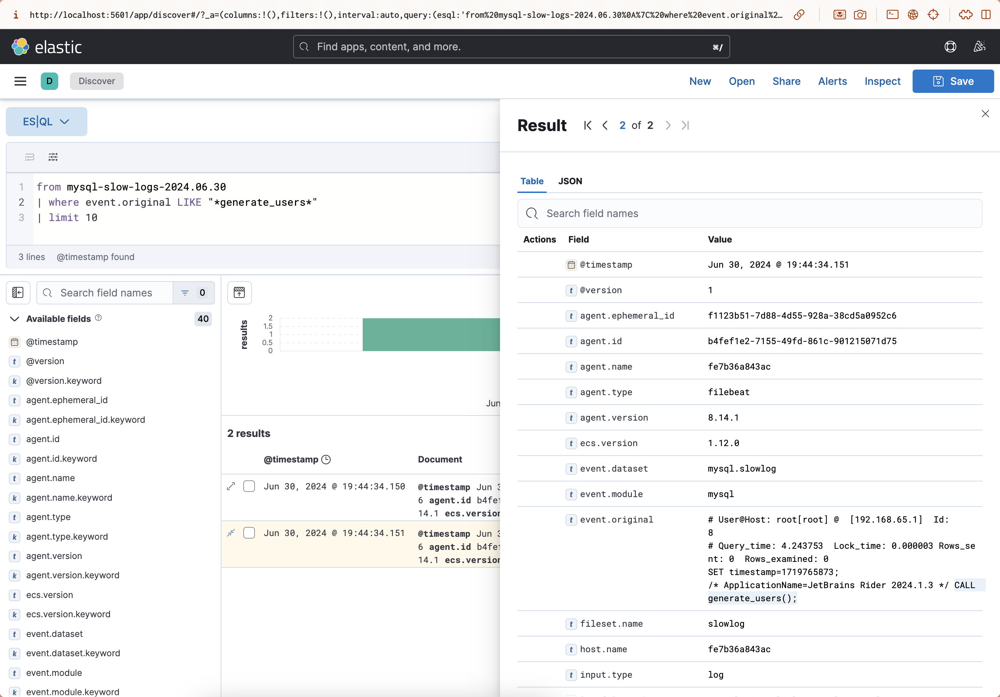

# Homework: Logging

## Task

1. Set up MySQL with slow query log
2. Configure ELK to work with mysql slow query log
3. Configure GrayLog2 to work with mysql slow query log
4. Set different thresholds for `long_query_time` (0, 1, 10) and compare performance

## Solution

### ELK

1. Prepare [docker-compose](./docker-compose.yml) file
2. Prepare MySQL configuration file [mysql/my.cnf](./mysql/my.cnf)
3. Prepare Logstash configuration file [logstash.conf](./logstash/pipeline/logstash.conf)
4. Prepare Filebeat configuration file [filebeat.yml](./filebeat/filebeat.yml)
5. Run

Make sure MySQL log file is accessible by changing permissions for `/var/log/mysql` directory:
```bash
chmod -R +rx /var/log/mysql
```

Filebeat is configured to input MySQL slow query log file from `/var/log/mysql/mysql-slow.log` and output it to Logstash:
```yaml
filebeat.modules:
  - module: mysql
    error:
      enabled: true
      var.paths: ["/var/log/mysql/error.log*"]
    slowlog:
      enabled: true
      var.paths: ["/var/log/mysql/slow-mysql-query.log*"]

output.logstash:
  hosts: ["logstash:5044"]
```

MySQL logs folder `/var/log/mysql/` is mounted to the Filebeat container.

Logstash is configured to match MySQL slow query log entries and output them to Elasticsearch:
```conf
input {
  tcp {
    port => 5000
  }

  beats {
      port => 5044
    }
}

filter {
  grok {
    match => { 
      "message" => [
        "^# User@Host: %{WORD:user}\[[^\]]+\] @ %{IP:client_ip} \[%{DATA:client}\]",
        "^# Query_time: %{NUMBER:query_time:float}  Lock_time: %{NUMBER:lock_time:float}  Rows_sent: %{NUMBER:rows_sent:int}  Rows_examined: %{NUMBER:rows_examined:int}",
        "^SET timestamp=%{NUMBER:timestamp};",
        "^%{GREEDYDATA:query}"
      ] 
    }
  }
}

output {
  elasticsearch {
    hosts => "elasticsearch:9200"
    index => "mysql-slow-logs-%{+YYYY.MM.dd}"
  }

  stdout { codec => rubydebug }
}
```



### GrayLog2

I find it really difficult to configure GrayLog2 to work with MySQL in Docker based on provided examples in slides and documentation.
I gave a try to configure it — [docker-compose-gl2.yml](./docker-compose-gl2.yml).
