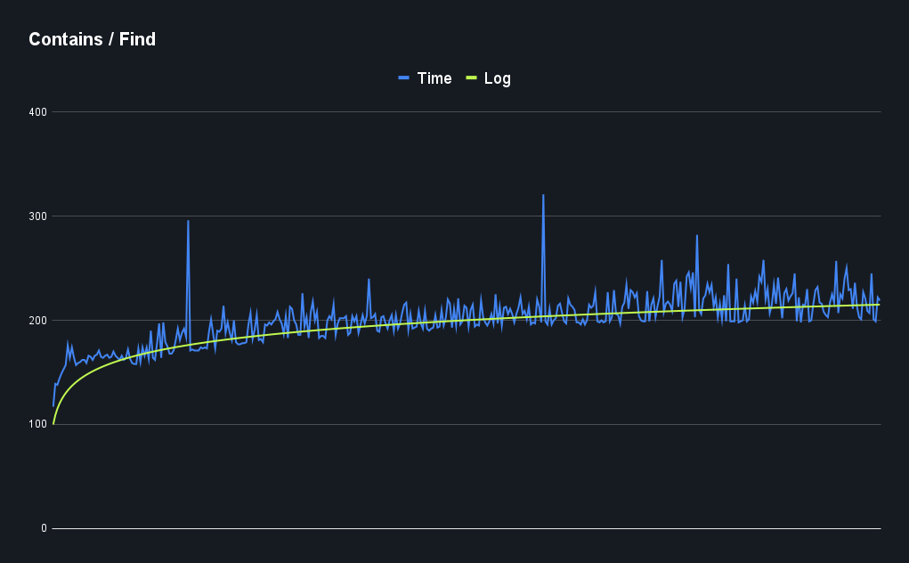
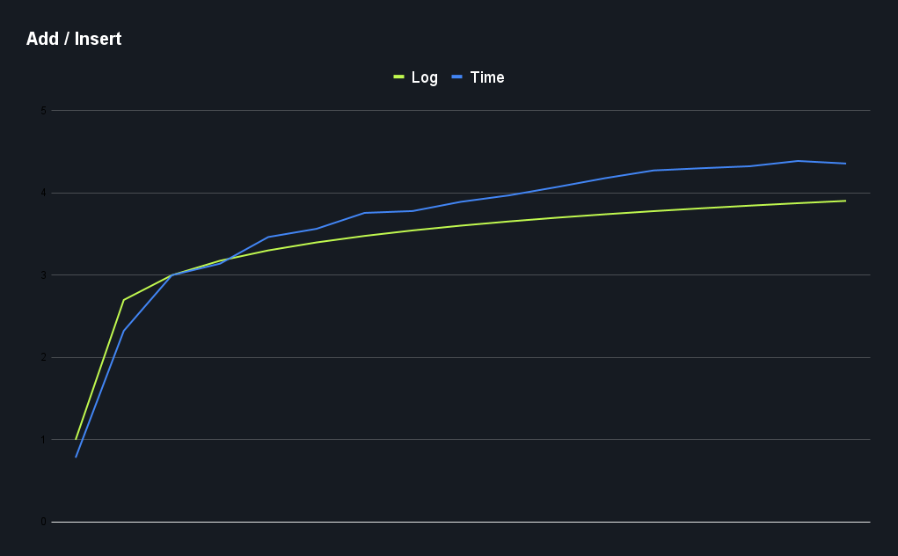

# Homework: Algorithms and Data Structures

## Task

1. Implement Balanced Binary Search Tree class and operations of insert/delete/search
2. Generate 100 random datasets and measure complexity
3. Implement Counting Sort algorithm
4. Figure out when Counting Sort doesn't perform

## Solution

### Balanced Binary Search Tree

The implementation of the Balanced Binary Search Tree is based on the AVL tree and the operations are implemented in the [BalancedBinarySearchTree.cs](./src/App/App/BalancedBinarySearchTree.cs).

There are two benchmarks implemented in the [BenchmarkTreeManual.cs](./src/App/App/BenchmarkTreeManual.cs) with simple manual data generation and [BenchmarkTree.cs](./src/App/App/BenchmarkTree.cs) with BenchmarkDotNet tool.

#### Contains Method

#### Add Method

### Counting Sort

> The basic idea behind Counting Sort is to count the frequency of each distinct element in the input array and use that information to place the elements in their correct sorted positions.

The implementation of the Counting Sort algorithm is located in [CountingSort.cs](./src/App/App/CountingSort.cs) file.

The algorithm has the following steps:

1. Find out the maximum element from the `input[]`.
2. Initialize a `count[]` of length `max+1` with all elements as `0`. This array will be used for storing the occurrences of the elements of the input array.
3. In the `count[]`, store the count of each unique element of the `input[]` at their respective indices.
4. Store the cumulative sum or prefix sum of the elements of the `count[]` by doing `count[i] = count[i – 1] + count[i]`. This will help in placing the elements of the `input[]` at the correct index in the `output[]`.
5. Iterate from end of the `input[]` because traversing `input[]` from end preserves the order of equal elements, which eventually makes this sorting algorithm stable.
   1. `output[count[input[i]] - 1] = input[i]`
   2. `count[input[i]]--`

This algorithm has a time complexity of **O(n + k)**, where **n** is the number of elements in the input array and **k** is the range of the input.
It won't perform well when the range of the input is significantly larger than the number of elements in the input array.
