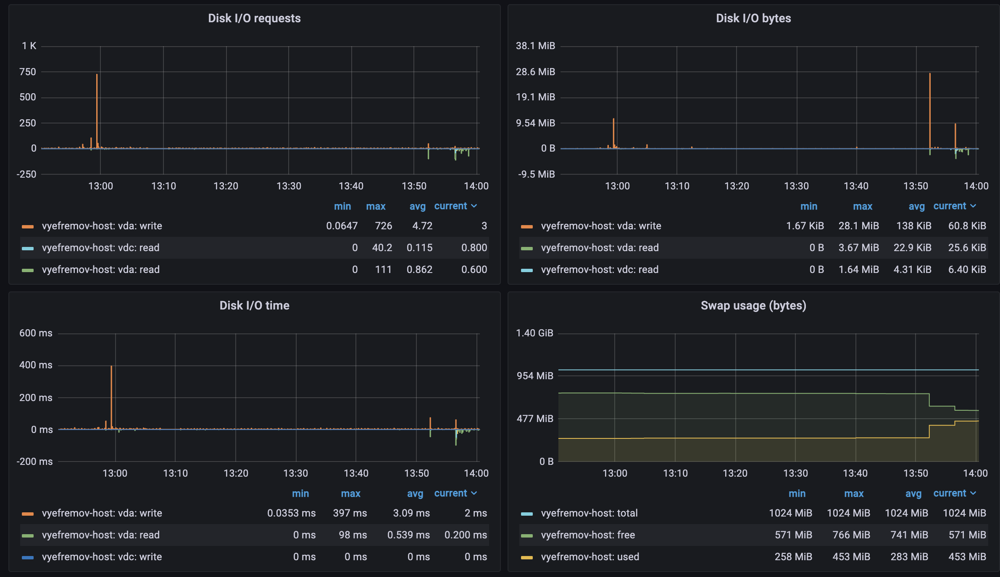
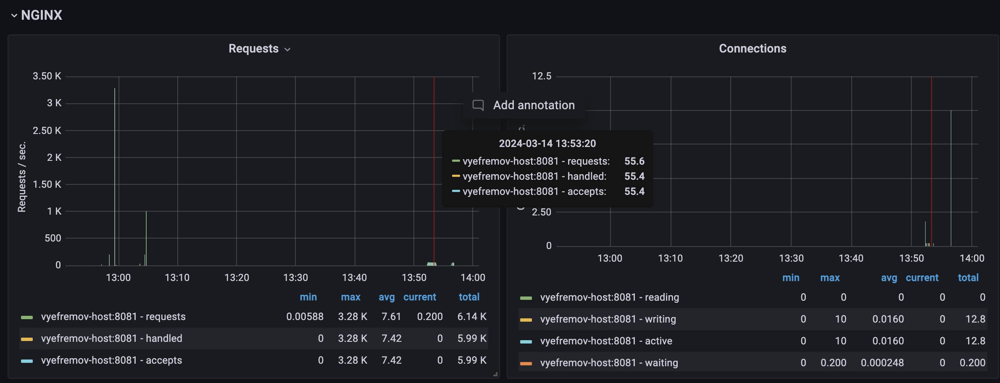
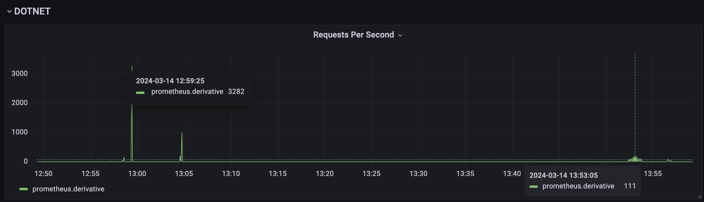
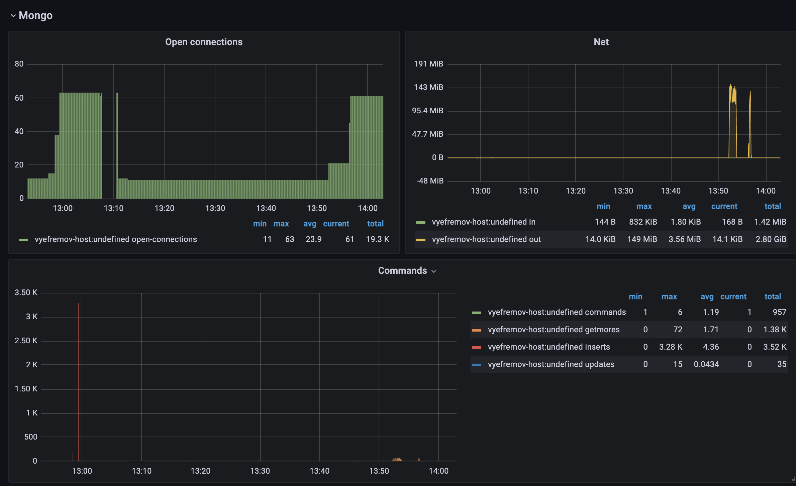
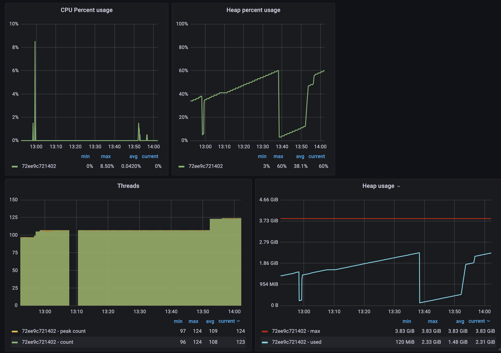
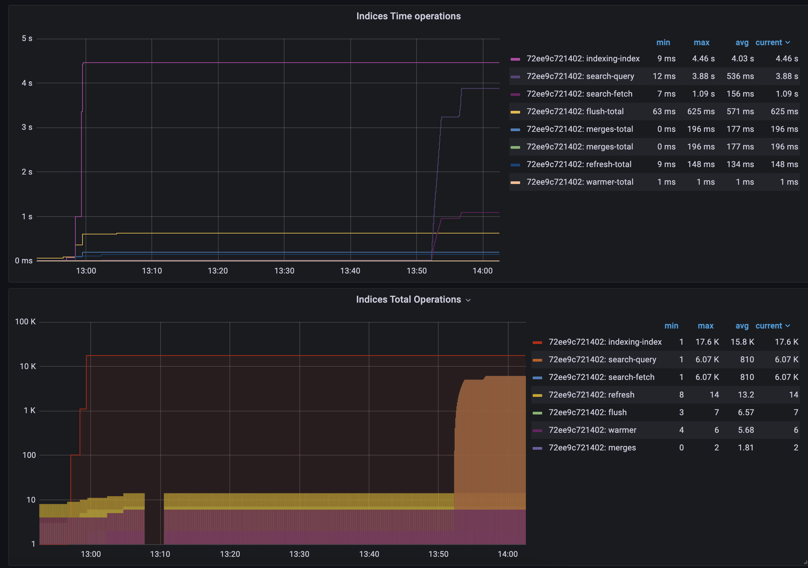
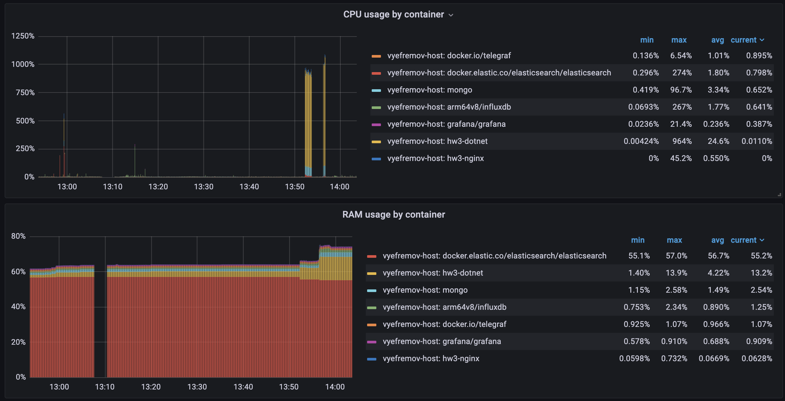
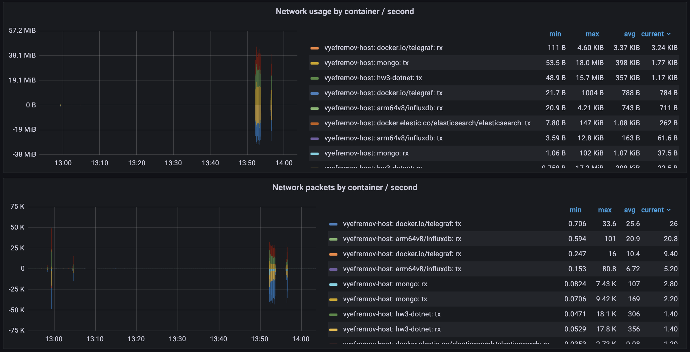

# HSA L3 Homework: Resource monitoring systems

## Introduction

#### This homework setups resource monitoring system for:

- .NET WebAPI 
- MongoDB
- Elasticsearch
- Nginx
- Docker containers

## Components

### Docker Compose

[docker-compose.yml](docker-compose.yml) file has the following services:
- dotnet-service-webapi based on [Dockerfile](dotnet-service/webapi/Dockerfile)
- elasticsearch
- mongodb
- nginx
- telegraf
- grafana
- influxdb

### Telegraf

[telegraf.conf](tig/telegraf.conf) is the configuration file for telegraf. It has the following plugins enabled:
- `outputs.influxdb`
- `inputs.docker`
- `inputs.http` to collect metrics from dotnet webapi
- `inputs.nginx`
- `inputs.mongodb`

### Dotnet WebAPI

[Program.cs](dotnet-service/webapi/Program.cs) is the entry point for the dotnet webapi. It has the following endpoints:
- `GET /analytics/events/summary`
- `POST /analytics/events`
- `GET /metrics` (for telegraf to collect metrics)

### Nginx

[nginx.conf](nginx/nginx.conf) is the configuration file for nginx. It has the following configurations:
- `GET /nginx_status on port:8081` serves metrics for `telegraf.inputs.nginx`
- Other requests `on port:8080` are proxied to Dotnet WebAPI

## Setup

1. Run `docker-compose up --build -d` to build and start containers.
2. Open `http://localhost:3000` to access Grafana. Use credentials from [configuration.env](tig/configuration.env) to login.

## Troubleshooting

1. If Grafana cannot draw pie chart because plugin is not installed:
   1. Connect to Grafana container using `docker exec -it grafana /bin/bash`
   2. Run `grafana-cli plugins install grafana-piechart-panel`
   3. Restart Grafana container using `docker restart grafana`
2. If Telegraf cannot access docker socket:
   1. Connect to Telegraf container using `docker exec -it telegraf /bin/bash`
   2. Run `cd /var/run` and then run `chmod 777 ./docker.sock`
   3. Restart Telegraf container using `docker restart telegraf`

## Results

### Testing

- `POST /analytics/events` stores document both to MongoDB and Elasticsearch databases.
  - Each request add 1 document to each database.
- `GET /analytics/events/summary` returns summary of events both from MongoDB and Elasticsearch databases.
  - Get requests were executed on both databases and fetch ALL (> 15k records) the data.

### Runs
- `POST` request tests were done at 13:00 and 13:05 on 14th Mar 2024
- `GET` request tests were done at 13:52 and 13:56 on 14th Mar 2024 (after the `POST` tests)
- There we more tests runs with different number of requests and concurrent requests (but not all were logged)

| Endpoint                        | Number of requests | Number of concurrent requests | Requests per second  [#/sec] (mean) | Time taken for test | Total transfered bytes |
|---------------------------------|--------------------|-------------------------------|-------------------------------------|---------------------|------------------------| 
| `POST /analytics/events`        | 100                | 10                            | 1060.79                             | 0.094 seconds       | 12200                  |
| `POST /analytics/events`        | 1000               | 50                            | 2066.56                             | 0.484 seconds       | 122000                 |
| `GET /analytics/events/summary` | 5000               | 10                            | 55.23                               | 20.338 seconds      | 9715630000             |
| `GET /analytics/events/summary` | 1000               | 50                            | 49.17                               | 90.537 seconds      | 1943126000             |

### Grafana

### System

- Its notable on the system dashboard there is a spike in Disc I/O write at 13:00. This is when the `POST` requests were made.
- There is also a spike in Disc I/O read at 13:52. This is when the `GET` requests were made. We also can se the bytes count spike at this time.

### Nginx

- The Nginx dashboard shows the number of requests made to the server. We can see the number of requests spike at 13:00, 13:05 and 13:52.
- The spike at 13:52 is smaller due to the number of `GET` requests being smaller.

### Dotnet WebAPI

- The Dotnet WebAPI dashboard shows the number of requests made to the server per second. It's similar to what Nginx shows.

### MongoDB

- The number of commands spikes at `POST` requests as them were making one command to MongoDB each. But it's not high on `GEt` requests as the amount of them were less. 
- The network traffic spikes on `GET` requests at 13:52 as it fetches all the data from the database.

### Elasticsearch

- The CPU usage spikes at 13:00 and 13:05 as the `POST` requests were made as Elasticsearch needs to index the records.
- The search operations grow at 13:52 as the `GET` requests were made.

### Docker

- The CPU usage were high for `dotnet` container when big amount of requests were made. This is expected as we need to serialize and deserialize requests and data. Same for `mongodb` and `elasticsearch`.
- For some reason `elasticsearch` takes a lot of RAM. May need to configure it to use less.
- Network usage is much higher on `GET` requests as it fetches all the data from the databases.
 

